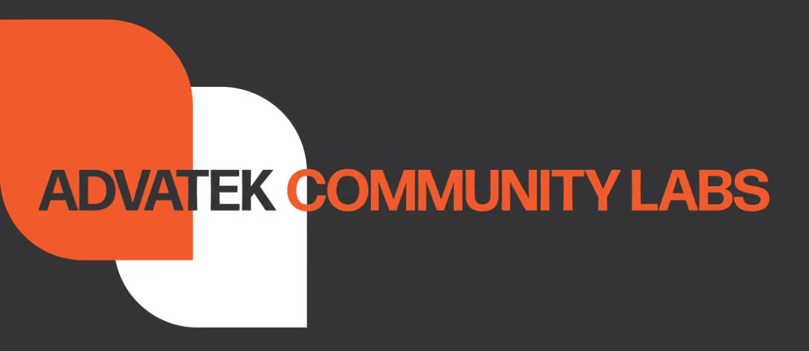

  

Community-driven projects, tools, and resources for Advatek products. Not officially supported by Advatek Lighting.

## Public projects

Community projects for Advatek products.

| Project | Status | Purpose |
| --- | --- | --- |
| [PixLite Mk3 Contact Trigger](https://github.com/advatekcommunitylabs/PixLite-Mk3-Contact-Trigger) | Community hardware project | Turns physical switches and relay contacts into PixLite Mk3 scene, playlist, intensity and test mode actions. |
| [PixLite Mk3 TouchDesigner](https://github.com/advatekcommunitylabs/PixLite-Mk3-TouchDesigner) | Community software project | Connects TouchDesigner to PixLite Mk3 controllers for real-time control and pixel-data workflows. |

## Support boundaries

Each repository explains its project and support status. Advatek Technical
Support does not cover these community projects unless a repository states
otherwise.

For Advatek Lighting products, official documentation and support, visit
[advateklighting.com](https://www.advateklighting.com).

## Contributing

Issues and pull requests are welcome where enabled. Check the target
repository's README and contributing guidance before proposing a change.

Contact Advatek to propose a new community project.
